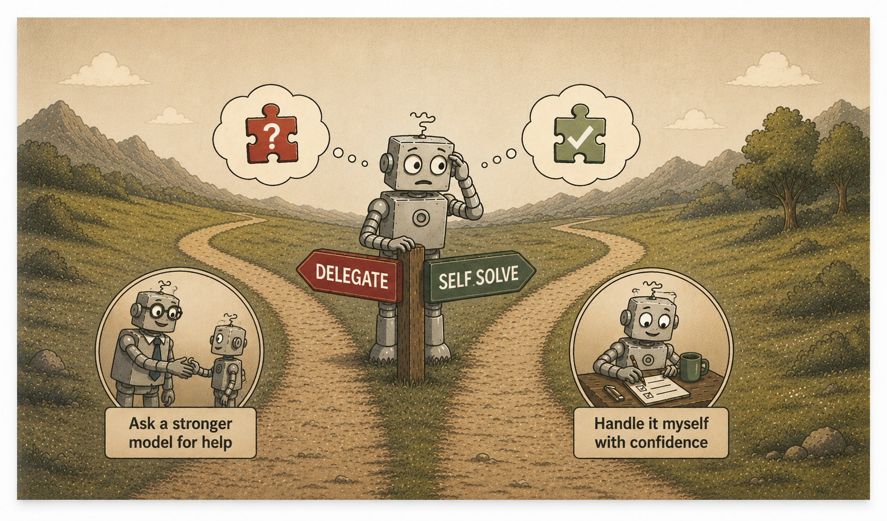
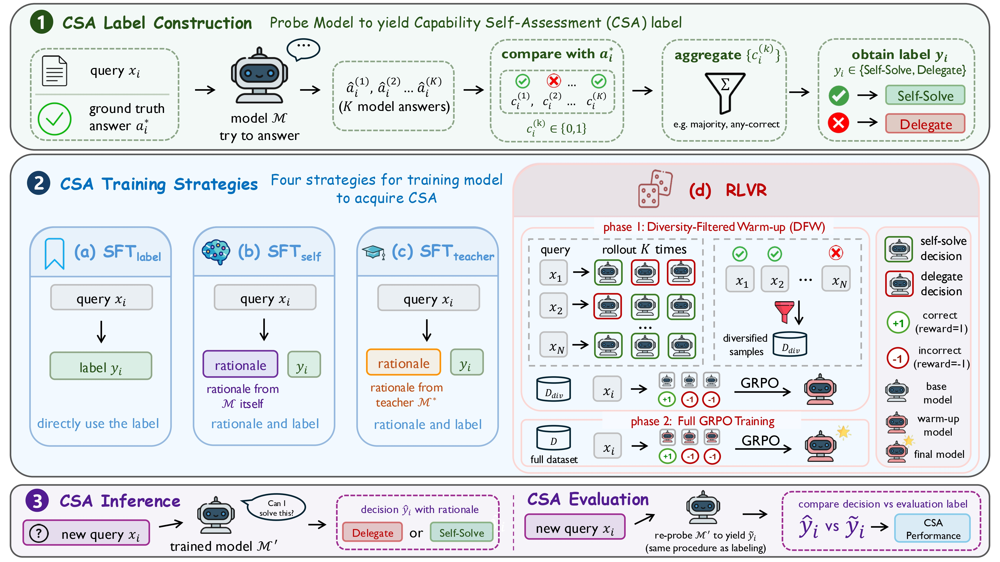

<h1 align="center">Capability Self-Assessment:<br>Teaching LLMs to Know Their Limits</h1>

<p align="center">
  <a href="#"></a>
  <a href="#"></a>
  <a href="#"></a>
</p>

<!-- =============================================================== -->
<!-- TEASER / HERO FIGURE                                            -->
<!-- Replace `assets/teaser.png` with your promotional figure.       -->
<!-- Suggested: a single eye-catching image that conveys the core    -->
<!-- idea of CSA at a glance (e.g. the SELF_SOLVE / DELEGATE         -->
<!-- routing intuition, or headline results).                        -->
<!-- =============================================================== -->
<p align="center">
  
</p>

> **TL;DR.** We define **Capability Self-Assessment (CSA)** as a model's ability to judge whether a query falls within its own solvable set, formulated as a binary policy choice between **`SELF_SOLVE`** (attempt the query) and **`DELEGATE`** (defer to a stronger system). Across model families and scales, current LLMs systematically overestimate themselves. We show that CSA is *teachable*, that **RLVR** (reinforcement learning with verifiable rewards) injects it more effectively than supervised fine-tuning, and that the learned behavior preserves the model's underlying problem-solving ability and transfers across domains.

---

## 📁 Repository Structure


`````
llm-csa/
├── src/                         # All Python source (invoked as `python -m src.<pkg>.<mod>`)
│   ├── data/                    # Dataset construction, answer generation, grading,
│   │                            # analysis generation, SFT data assembly
│   ├── csa/                     # CSA inference (local vLLM + closed APIs),
│   │                            # CSA evaluation, Capability Ratio computation
│   ├── training/                # SFT, GRPO, and DFW
│   ├── hub/                     # HuggingFace upload helpers
│   └── utils/                   # Shared: prompts, parsing, vLLM, IO, grading
│
├── scripts/                     # Shell launchers + YAML configs
│   ├── data/                    # build_dataset_* / generate_answers* /
│   │                            # generate_analysis_{self,teacher} / build_sft_dataset
│   ├── inference/               # inference_local / inference_api
│   ├── evaluation/              # grade_math / grade_science /
│   │                            # evaluate_csa / capability_ratio
│   ├── training/                # SFT / GRPO YAML configs + run_sft / run_dfw / run_grpo
│   │                            # + accelerate (DeepSpeed ZeRO-3) configs
│   └── hub/                     # upload_dataset / upload_model
│
├── dataset/                     # Pre-built benchmark datasets, ready to use
│   ├── math/                    # GSM8K + MATH-500 + AIME
│   └── science/                 # MMLU-Pro (bio / chem / health / physics)
│
├── requirements.txt
└── README.md
`````

---

## 🛠️ Setup

`````bash
git clone https://github.com/Joyyang158/llm-csa.git
cd llm-csa
pip install -r requirements.txt
`````

Environment variables (only set the ones you need):

| Variable | Used by |
| --- | --- |
| `HF_TOKEN` | `scripts/hub/upload_*.sh`, gated HF model downloads |
| `TOGETHER_API_KEY` | `scripts/data/generate_answers_api.sh`, `scripts/data/generate_analysis_teacher.sh` |
| `OPENAI_API_KEY` / `GOOGLE_API_KEY` / `ANTHROPIC_API_KEY` | `scripts/inference/inference_api.sh` |
| `WANDB_API_KEY` | training |

---

## 🧠 Method Overview

Our framework has three stages. **① CSA Label Construction** probes the model to derive per-query `SELF_SOLVE` / `DELEGATE` labels. **② CSA Training Strategies** instills CSA into the model via one of four approaches: three SFT variants and RLVR. **③ CSA Inference & Evaluation** lets the trained model decide on new queries, and verifies both decision quality and that the model's problem-solving ability is preserved.

<!-- =============================================================== -->
<!-- METHOD FIGURE                                                   -->
<!-- Replace `assets/method.png` with the method overview figure     -->
<!-- (the three-stage pipeline: label construction → training        -->
<!-- strategies → inference & evaluation).                           -->
<!-- =============================================================== -->
<p align="center">
  
</p>

The four training strategies in Stage ②. The table below shows the **output format** (what the model emits at inference time) and whether each strategy requires a **supervision rationale generation** pass before training begins.

| Strategy | Output format | Needs supervision rationale generation? |
| --- | --- | --- |
| **(a) SFT_label** | `<decision>` only | No |
| **(b) SFT_self** | `<analysis>` + `<decision>` | Yes. Rationales come from the training model itself |
| **(c) SFT_teacher** | `<analysis>` + `<decision>` | Yes. Rationales come from a stronger teacher model |
| **(d) RLVR** | `<analysis>` + `<decision>` | No. Rationales emerge during RL rollouts |

---

## 🚀 Quick Start


All local inference paths go through `vllm.LLM`. Both SFT and GRPO use full-parameter fine-tuning with DeepSpeed ZeRO-3, and the accelerate configs live in `scripts/training/`. The sections below follow the three stages above.

Most launchers are driven by **environment variables** (override the defaults shown in each script header), and a few take a YAML config as a **positional argument**. Each command below highlights the key knobs; less common settings (sampling temperatures, max-token caps, paths, etc.) are documented at the top of every script.

### ① CSA Label Construction

We evaluate on two domains:

* **math**: GSM8K, MATH-500, AIME. Open-ended; final answers in `\boxed{...}`.
* **science**: MMLU-Pro restricted to biology / chemistry / health / physics. Multiple-choice; each test query is sampled with multiple option-shuffles and aggregated by majority vote.

We provide pre-built benchmarks for both domains under [`dataset/`](dataset/), and we also provide the code to build them under [`scripts/data/`](scripts/data/) and [`src/data/`](src/data/) in case you want to change the dataset composition (for example, adjust the per-source ratio).


`````bash
bash scripts/data/build_dataset_math.sh
bash scripts/data/build_dataset_science.sh
`````

**Step 1: Collect 5 samples per query from the target model** (vLLM-backed; use `generate_answers_api.sh` for hosted models).

`````bash
DOMAIN=[math/science] SPLIT=train bash scripts/data/generate_answers.sh
DOMAIN=[math/science] SPLIT=test  bash scripts/data/generate_answers.sh
`````

**Step 2: Grade the samples to derive the per-row `is_correct` label.**

`````bash
bash scripts/evaluation/grade_math.sh
bash scripts/evaluation/grade_science.sh
`````

### ② CSA Training Strategies

All training launchers load their dataset from the HuggingFace Hub via the `dataset_name` field in the YAML config (`sft.yaml` / `grpo.yaml`), so the CSVs you built in Stage ① need to be pushed to the Hub first. We provide [`scripts/hub/upload_dataset.sh`](scripts/hub/upload_dataset.sh) for this; it requires `HF_TOKEN`:

`````bash
CSV_PATH=path/to/data.csv  REPO_ID=your-username/csa-sft-dataset \
    bash scripts/hub/upload_dataset.sh
`````

In addition, you can optionally use [`scripts/hub/upload_model.sh`](scripts/hub/upload_model.sh) to push a trained checkpoint folder to the Hub. This is not required by the training pipeline itself.

`````bash
LOCAL_DIR=path/to/checkpoint  REPO_ID=your-username/csa-model \
    bash scripts/hub/upload_model.sh
`````

#### (a) SFT_label: bare label, no rationale

Set `sft_mode: label` in `scripts/training/sft.yaml`, then pass the YAML config to the launcher:

`````bash
bash scripts/training/run_sft.sh scripts/training/sft.yaml
`````

#### (b) SFT_self: self-generated rationale + label

First have the training model generate rationales for itself (conditioned on the ground-truth label), then assemble the SFT CSV.

`````bash
DOMAIN=[math/science] SPLIT=train bash scripts/data/generate_analysis_self.sh
DOMAIN=[math/science] bash scripts/data/build_sft_dataset.sh
`````

Set `sft_mode: self` in `scripts/training/sft.yaml` and run:

`````bash
bash scripts/training/run_sft.sh scripts/training/sft.yaml
`````

#### (c) SFT_teacher: teacher-distilled rationale + label

Same as (b), but rationales come from a stronger teacher model (requires `TOGETHER_API_KEY`; defaults to `Qwen/Qwen3-235B-A22B-Instruct-2507-tput`, override via `TEACHER_MODEL`):

`````bash
DOMAIN=[math/science] SPLIT=train bash scripts/data/generate_analysis_teacher.sh
DOMAIN=[math/science] bash scripts/data/build_sft_dataset.sh
`````

Set `sft_mode: teacher` in `scripts/training/sft.yaml` and run:

`````bash
bash scripts/training/run_sft.sh scripts/training/sft.yaml
`````

#### (d) RLVR: two-stage GRPO with Diversity-Filtered Warm-up

**Phase 1: DFW (Diversity-Filtered Warm-up).** `run_dfw.sh` first retains only queries whose K=16 rollouts contain *both* `SELF_SOLVE` and `DELEGATE` to construct a diversified subset *D*<sub>div</sub>. `MODEL_NAME` (the initial policy to roll out from) is required.

`````bash
DOMAIN=[math/science] MODEL_NAME=path/to/initial-policy \
    bash scripts/training/run_dfw.sh
`````

Then run a round of GRPO on this diversified subset to produce the warm-up checkpoint. Point `grpo.yaml` at *D*<sub>div</sub> as the training data, then:

`````bash
bash scripts/training/run_grpo.sh scripts/training/grpo.yaml
`````

**Phase 2: Full GRPO.** Continue GRPO training on the full dataset, starting from the warm-up checkpoint. Update model / dataset paths in `grpo.yaml` to point at the Phase 1 checkpoint and the full dataset, then:

`````bash
bash scripts/training/run_grpo.sh scripts/training/grpo.yaml
`````

Note: For OLMo-2 models, skip Phase 1. Their rollouts are already diverse enough that DFW is unnecessary, so run only Phase 2 on the full dataset.

### ③ CSA Inference & Evaluation

**Inference.** Run the trained model on the held-out test split. `MODEL_NAME` points at the trained CSA checkpoint.

`````bash
DOMAIN=[math/science] SPLIT=test MODEL_NAME=path/to/csa-checkpoint \
    bash scripts/inference/inference_local.sh
`````

The model emits an `<analysis>` block followed by a `<decision>` (`SELF_SOLVE` or `DELEGATE`). Parsing is in `src/utils/parsing.py:parse_decision`.

**Evaluation.** After training, the model's underlying problem-solving ability may have shifted, so the original `is_correct` labels (probed from the model *before* training) no longer reflect what the model can actually solve *after* training. Both evaluations below therefore start from the same prerequisite: re-generating answers with the trained model on the test split.

`````bash
# Re-generate 5 samples per test query using the model after training.
DOMAIN=[math/science] SPLIT=test bash scripts/data/generate_answers.sh
`````

**(a) CSA quality.** Does the model make the right `SELF_SOLVE` / `DELEGATE` decisions? `src/csa/evaluate.py` reports **CDS** (Capability Discrimination Score) and **M-F1** as the main metrics, with Accuracy and SSR also reported as references.

The script supports two grading modes via `GRADE_MODE`. The two modes differ only in which `is_correct` labels they grade against:

* **`generations` (default, recommended).** Grades against the answers freshly re-generated above (`GT_CSV_PATH`), so `is_correct` reflects the model's ability *after* training. This is what you want for honest evaluation, because CSA training may have shifted that ability.
* **`column`.** Uses the `is_correct` column already in `CSV_PATH`, which reflects the model's ability *before* training. Provided as an option if you specifically want to compare against the original snapshot.

`````bash
# Recommended: grade against the model's ability after training
GRADE_MODE=generations DOMAIN=[math/science] \
    CSV_PATH=path/to/csa-predictions.csv \
    GT_CSV_PATH=path/to/regenerated-answers.csv \
    bash scripts/evaluation/evaluate_csa.sh

# Optional: grade against the original (before-training) labels
GRADE_MODE=column \
    CSV_PATH=path/to/csa-predictions.csv \
    bash scripts/evaluation/evaluate_csa.sh
`````

**(b) Capability Ratio (CR).** Does CSA training preserve the model's underlying problem-solving ability? CR is the ratio of solve accuracy *after* training to solve accuracy *before* training on the same evaluation set. Pass the two generation CSVs (`PRE_CSV` and `POST_CSV`), produced by Step 2 of label construction and by the re-generation step above:

`````bash
DOMAIN=[math/science] \
    PRE_CSV=path/to/before-training/test.csv \
    POST_CSV=path/to/after-training/test.csv \
    bash scripts/evaluation/capability_ratio.sh
`````

---

## 📚 Citation

If you find our paper or this repository useful, please cite:

`````bibtex
@misc{yang2026capabilityselfassessmentteachingllms,
      title={Capability Self-Assessment: Teaching LLMs to Know Their Limits}, 
      author={Haoyan Yang and Reza Shirkavand and Yukai Jin and Jiawei Zhou and Shangqian Gao and Heng Huang},
      year={2026},
      eprint={2606.00251},
      archivePrefix={arXiv},
      primaryClass={cs.AI},
      url={https://arxiv.org/abs/2606.00251}, 
}